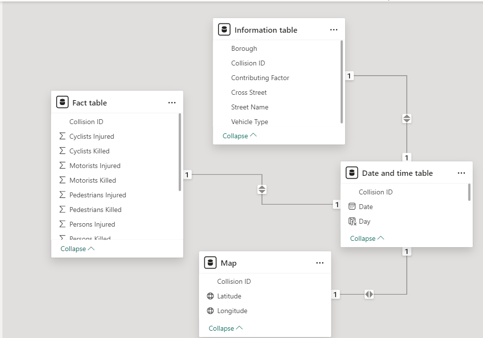
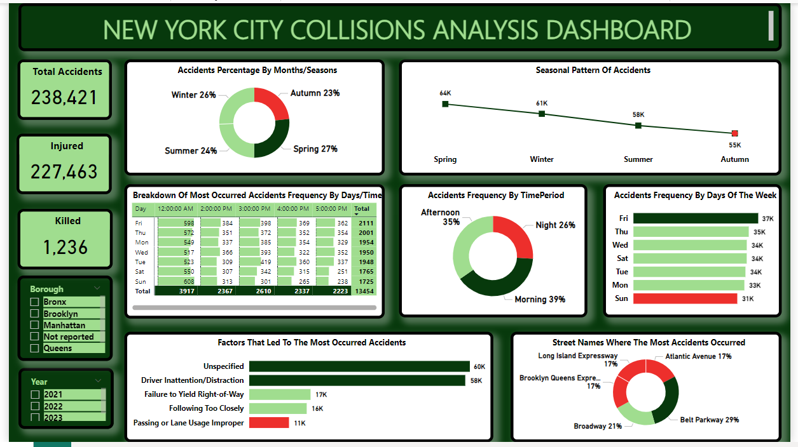
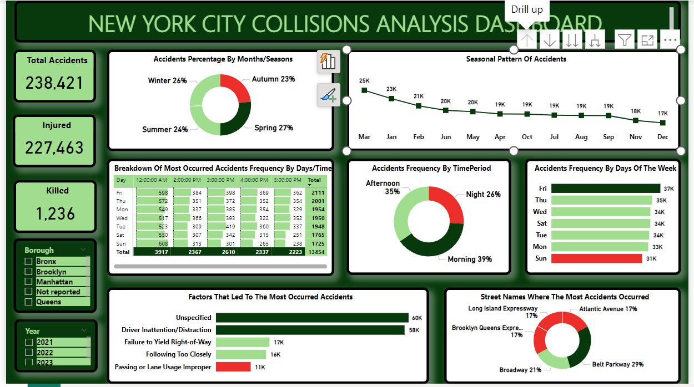

# New-York-City-Collisions-Analysis

## Introduction
This is a power BI project on motor vehicle collisions reported by the New York City Police Department from January-August 2020.
Each record represents an individual collision, including the date, time and location of the accident
(borough, zip code, street name, latitude/longitude), vehicles and victims involved, and contributing
factors.

This project is to analyze the dataset and provide answers to the questions listed below:

**_Disclaimer_**: This dataset and reports is for my final capstone project for my data analytics training to demonstrate my capabilities on power BI.

## Problem statement:
- Question 1.
Compare the % of total accidents by month. Do you notice any seasonal patterns?
- Question 2.
Break down accident frequency by day of week and hour of day. Based on this data, when do accidents
occur most frequently?
- Question 3.
On which particular street were the most accidents reported? What does that represent as a % of all
reported accidents?
- Question 4.
What was the most common contributing factor for the accidents reported in this sample?

## Skills/concept demonstrated:
The following power Bi features were incorporated;
- Data Cleaning and Transformation
- Modelling
- DAX
- Measures
- Data Visualization
- Problem Solving

## Tool used:
- Power BI

## Modelling:
Automatically derived relationships were applied as it matched the required relationships.
Auto Model
:---------------------------------------------------:
                                  

This model is a star schema.
There are 3 dimension tables and 1 fact table. The dimension tables are all joined to the fact table with a one to many relationships.

## Visualization:
The report comprises 6 key insights:
- 1: Accidents percentage by seasons
- 2: Seasonal pattern of accidents
- 3: Monthly pattern of accidents
- 4: Breakdown of accidents frequency by days of the week and time period
- 5: Contributing factors of accidents
- 6: Streets where most accidents accurred

You can interact with the report [https://app.powerbi.com/view?r=eyJrIjoiNTg0YjZjNzMtZTM4MC00ZTY5LTk1ZTMtOTI4MzMzNTJhMjdlIiwidCI6IjE4MTk3OTFkLTFhZjUtNDZiMC1iNDQ3LWFiYWMwMzVjZjQzYiJ9](https://app.powerbi.com/view?r=eyJrIjoiNTg0YjZjNzMtZTM4MC00ZTY5LTk1ZTMtOTI4MzMzNTJhMjdlIiwidCI6IjE4MTk3OTFkLTFhZjUtNDZiMC1iNDQ3LWFiYWMwMzVjZjQzYiJ9)
Dashboard 1                                           |         Dashboard 2
:----------------------------------------------------:|:------------------------------------------------------------:
                                   |

## Features:
The slicer allows you to navigate more analysis of the dashboard that are not currently on display regarding the category topics.

## Measures:
- The report recorded a total of **238,421** accidents
- Total injured **227,463**
- Total killed **1,236**

## Recommended analysis:
### Q1:
- New york city has 4 seasons each year (Winter, spring, summer and autumn).
- The report showed that spring (Mar-May) had the highest percentage of accidents by 27%, followed by winter (Dec-Feb) at 26%, and summer (Jun-Aug) at 24%, while autumn (Sep-Nov) recorded the lowest accidents occurrance at 23%.
- For some reasons the accident percentage of spring was slightly hihger than that of winter but apart from that, there is a seasonal decrease in the percentage of accidents.

### Q2:
- The break down accident frequency by days of the week and hours of the day showed that accidents occur most frequently on fridays and around 12:00 AM.
- Further break down showed that morning recorded 39% of accidents, folloerd by afternoon at 35%, while night has the lowest accidents occurrance frequency of 26%.

### Q3: Judging by the top 5 streets where most accidents occurred;
- Most accidents occurrance were reported at Belt parkway by 29%, followed by Broadway at 21%, while Brooklyn Queens Expressway,Long Island Expressway and Atlantic Avenue each recorded the lowest accidents occurrance report by 17% respectively.

### Q4: Judging by the top 5 most common contributing factor for the accidents reported in this sample
- The most common contributing factor for the accidents reported in this sample were not specified.
- But the 2nd most common contributing factor was driver inattention/distraction, followed by failure to yield right of way, following too closely and lastly passing or lane usage improper.

## Conclusion:
Navigating the features of Power BI was challenging at first but the end result was rewarding 😊.

